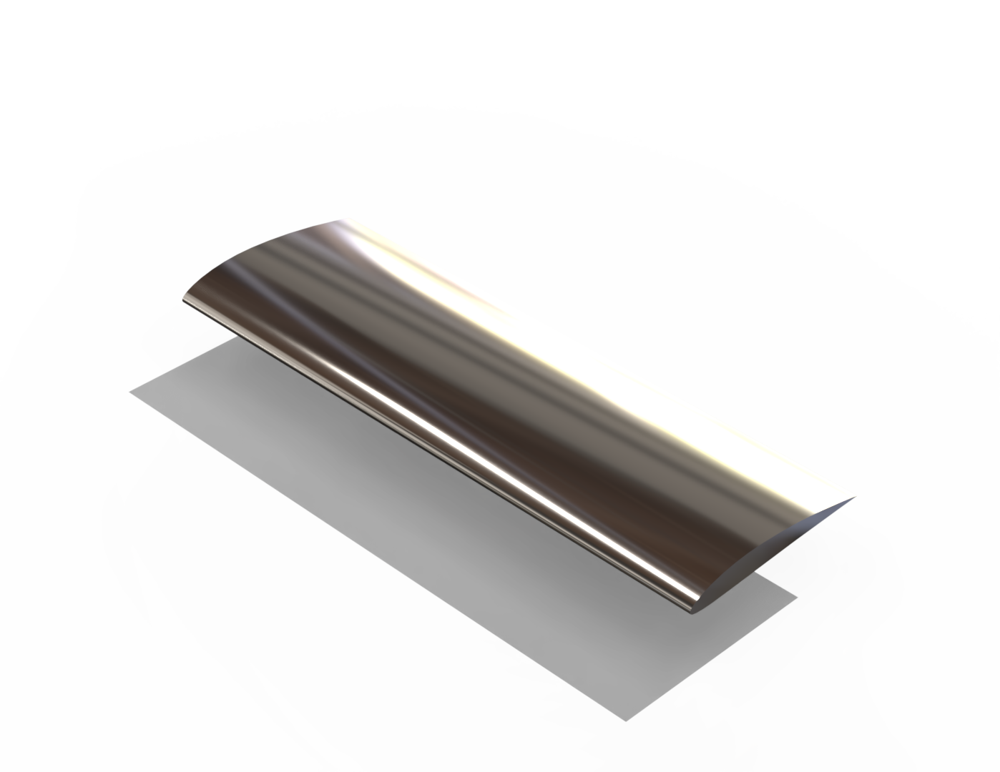

# 🚀 Aerospace Wing Design & Analysis Automation

This project automates the workflow for NACA 4-digit airfoil analysis and converts mathematical results into 3D CAD geometries. It bridges the gap between Python-based aerodynamic calculations and SolidWorks/CATIA modeling.

### 📐 Aerodynamic Visualization
Below is a 3D render of a wing section generated using this automation tool, showing the high-precision profile transition.

  

---

### 🛠️ Features

* **NACA Profile Generation:** Automates the geometry calculation for any 4-digit NACA airfoil.
* **System Automation:** Bash scripting (`analiz_merkezi.sh`) to streamline data export and processing.
* **3D Modeling Integration:** Generates coordinate point clouds optimized for SolidWorks "Curve Through XYZ Points" feature.
* **Structural Consideration:** Designed for internal spar and rib integration.

### 📊 Tech Stack

* **Languages:** Python (Numerical Analysis), Bash (Automation)
* **CAD Tools:** SolidWorks / CATIA
* **Environment:** WSL2 / Ubuntu Linux on Windows

### 📂 Project Structure

* **kanat_raporu.py**: The core engine for aerodynamic calculations.
* **analiz_merkezi.sh**: The "control center" script for automation.
* **kati_model.py**: Generates the 3D-ready coordinate data.

---

### 💻 Developed By
**Alperen** - *Mechanical Engineering Student | Aspiring Aerospace Engineer*
